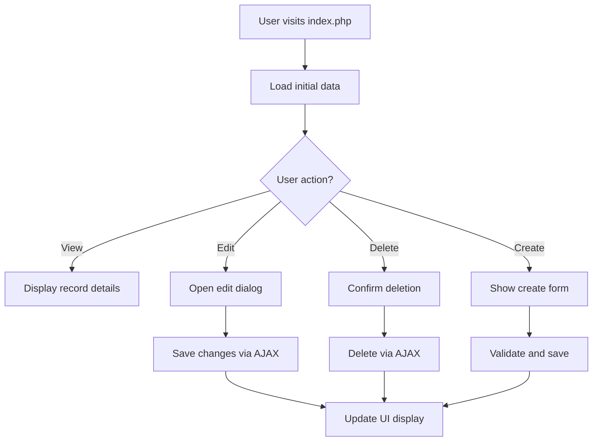

# [Feature Name] - Automated Application Flow Analysis Framework

**Feature ID**: [MODULE-XX] (ví dụ: SYS-01, REC-02, API-05)
**Priority**: [High/Medium/Low]
**Module**: [system/record/place/api/schedule]
**Screen Path**: [`/path/to/screen/index.php`](/path/to/screen/index.php:1)
**Analysis Date**: [YYYY-MM-DD]
**Framework Version**: 2.0 - Automated Flow Analysis

## 1. Overview - Tổng quan chức năng

### Mục đích chức năng:
- **Chức năng chính**: [Mô tả ngắn gọn chức năng]
- **Giải quyết vấn đề**: [Vấn đề business được giải quyết]
- **Workflow position**: [Vị trí trong quy trình tổng thể]
- **Healthcare domain**: [Liên quan đến lĩnh vực y tế nào]

### Target Users:
- [ ] Admin/Quản trị viên hệ thống
- [ ] Corporate Admin/Quản trị tổ chức
- [ ] Staff/Nhân viên chăm sóc
- [ ] Employee/Nhân viên thực hiện
- [ ] System/API tự động

## 2. Interface Analysis Module - Phân tích giao diện tương tác

### 2.1 Interactive Elements Catalog

#### Frontend File Analysis:
**Files scanned**: `index.php`, `js/*.js`, `css/*.css`, `dialog/*.php`

### 2.2. Mapping Data với Màn hình Hiển thị

| Tên hiển thị | Logic code hiển thị | Tên trường | Tên bảng |
|--------------|-------------------|------------|----------|
| **Thông tin cơ bản** |
| 利用者ID | `<?= h($dispData['other_id']) ?>` | other_id | mst_user |
| 利用者氏名 | `<?= h($dispData['user_name']) ?>` | last_name + first_name | mst_user |
| 訪問看護区分 | `$dispData['care_kb']` | care_kb | doc_visit2 |
| 重要 | `$dispData['importantly']` | importantly | doc_visit2 |

| Element Type | Element ID/Class | Event Handler | Navigation Path | Function Called |
|--------------|------------------|---------------|-----------------|-----------------|
| **Buttons** |
| Submit Button | `#btn-save` | `onclick="saveData()"` | POST to `/ajax/save-data.php` | [`saveData()`](js/feature.js:XX) |
| Edit Button | `.btn-edit` | `onclick="editRecord(id)"` | Modal dialog | [`editRecord()`](js/feature.js:XX) |
| Delete Button | `.btn-delete` | `onclick="deleteRecord(id)"` | Confirmation + DELETE | [`deleteRecord()`](js/feature.js:XX) |
| **Anchor Tags** |
| Detail Link | `.link-detail` | `href="detail.php?id={id}"` | `/module/detail/` | Server navigation |
| Export Link | `#export-csv` | `href="export.php"` | `/ajax/export.php` | File download |
| **Form Inputs** |
| Text Input | `#input-name` | `onchange="validateName()"` | Real-time validation | [`validateName()`](js/feature.js:XX) |
| Select Dropdown | `#select-status` | `onchange="filterData()"` | AJAX reload | [`filterData()`](js/feature.js:XX) |
| Date Picker | `.datepicker` | `onchange="dateValidate()"` | Date validation | [`dateValidate()`](js/feature.js:XX) |
| **Conditional Rendering** |
| Status Display | `<?php if($status == 1): ?>` | PHP condition | Show/Hide elements | Server-side logic |
| Permission Check | `<?php if($userRole >= 2): ?>` | Role validation | Access control | [`checkPermission()`](php/feature.php:XX) |

#### Event Handler Mapping:
```javascript
// File: js/feature.js
function saveData() {
    // Validation → AJAX POST → UI Update
    if (validateForm()) {
        $.post('/ajax/save-data.php', formData, function(response) {
            updateUI(response);
        });
    }
}

function editRecord(id) {
    // Load data → Show modal → Bind events
    loadRecordData(id).then(data => {
        showEditDialog(data);
        bindDialogEvents();
    });
}
```

### 2.3 User Journey Flow Map



## 3. Logic Processing Analysis - Phân tích xử lý business logic

### 3.1 Backend Function Flow Mapping

#### Core Business Logic Files:
**Files analyzed**: `php/*.php`, `../common/php/func_*.php`, `ajax/*.php`

| Frontend Action | Backend Function | File Location | Business Rules | Data Validation |
|-----------------|------------------|---------------|----------------|-----------------|
| **Save Record** | [`saveFeatureData()`](php/feature.php:XX) | `php/feature.php` | Required fields validation | XSS sanitization |
| **Load Data** | [`getFeatureList()`](php/feature.php:XX) | `php/feature.php` | Permission filtering | SQL injection prevention |
| **Delete Record** | [`deleteFeatureRecord()`](php/feature.php:XX) | `php/feature.php` | Cascade check | Audit logging |
| **Search/Filter** | [`searchFeatures()`](php/feature.php:XX) | `php/feature.php` | Multi-criteria filtering | Input sanitization |

#### Function Call Trace Analysis:

```php
// User Action: Save Record
saveFeatureData($postData) {
    // Step 1: Input validation
    $validation = validateInput($postData);
    if (!$validation['success']) return $validation;
    
    // Step 2: Business rules check
    $businessCheck = checkBusinessRules($postData);
    if (!$businessCheck['valid']) return $businessCheck;
    
    // Step 3: Database transaction
    $dbResult = SafeDatabaseUtils::transaction(function() use ($postData) {
        // Insert/Update main table
        $mainId = saveMainTable($postData);
        
        // Update related tables
        updateRelatedTables($mainId, $postData);
        
        // Log activity
        logActivity('SAVE', $mainId, $postData);
        
        return $mainId;
    });
    
    return ['success' => true, 'id' => $dbResult];
}
```

### 3.2 Data Flow Pattern Analysis

| Input Source | Processing Function | Validation Rules | Output Destination |
|--------------|-------------------|------------------|------------------|
| User Form | [`validateForm()`](php/feature.php:XX) | Required, Format, Business | Database Tables |
| AJAX Request | [`processAjaxRequest()`](ajax/save-data.php:XX) | CSRF, Permission | JSON Response |
| File Upload | [`handleFileUpload()`](php/feature.php:XX) | Type, Size, Security | File Storage + DB |
| Search Query | [`processSearch()`](php/feature.php:XX) | SQL Injection Prevention | Filtered Results |

### 3.3 Service Method Documentation

| Service Method | Purpose | Parameters | Return Value | Database Tables |
|----------------|---------|------------|--------------|-----------------|
| [`getUserList()`](../common/php/func_get.php:XX) | Load user data | `$corporate_id`, `$filters` | `Array of users` | `mst_user`, `mst_user_*` |
| [`makePlan()`](../common/php/func_set.php:XX) | Create care plan | `$user_id`, `$plan_data` | `Plan ID` | `dat_user_plan` |
| [`setEntryLog()`](../common/php/func_set.php:XX) | Activity logging | `$action`, `$target_id` | `Boolean` | `log_entry` |

## 4. Database Integration Mapping - Tích hợp cơ sở dữ liệu

### 4.1 Complete Data Flow Pipeline

#### Database Operation Tracing:

| User Interaction | Business Logic | Database Operation | Tables Affected | Query Type |
|------------------|----------------|-------------------|-----------------|------------|
| **Create New Record** |
| Click "Add New" button | [`createNewRecord()`](php/feature.php:XX) | `INSERT INTO main_table` | `[main_table]` | INSERT |
| → Fill form fields | [`validateInputs()`](php/feature.php:XX) | Validation queries | `mst_*` tables | SELECT |
| → Submit form | [`saveRecord()`](php/feature.php:XX) | Transaction with multiple tables | `[main_table]`, `log_entry` | INSERT, INSERT |
| **Edit Existing Record** |
| Click "Edit" button | [`loadEditData()`](php/feature.php:XX) | `SELECT * FROM main_table WHERE id = ?` | `[main_table]` | SELECT |
| → Modify fields | [`validateChanges()`](php/feature.php:XX) | Check constraints | Related tables | SELECT |
| → Save changes | [`updateRecord()`](php/feature.php:XX) | `UPDATE main_table SET ... WHERE id = ?` | `[main_table]`, `log_entry` | UPDATE, INSERT |
| **Delete Record** |
| Click "Delete" button | [`checkDependencies()`](php/feature.php:XX) | Foreign key validation | All related tables | SELECT |
| → Confirm deletion | [`deleteRecord()`](php/feature.php:XX) | Soft delete or CASCADE | `[main_table]`, dependencies | UPDATE/DELETE |

### 4.2 Docker Database Query Execution

#### Query Execution Framework:
```bash
# Template for Docker-based database operations
docker exec -i $(docker ps -q --filter "name=db") mysql -u kantaki -pkantaki kantaki_dev << 'EOF'
[SQL_QUERY_HERE]
EOF
```

#### Data Flow Analysis Queries:

```sql
-- 1. Trace user interactions to database changes
SELECT
    le.action_type,
    le.target_table,
    le.target_id,
    le.create_date,
    s.name as staff_name,
    le.memo
FROM log_entry le
LEFT JOIN mst_staff s ON le.create_user = s.unique_id
WHERE le.target_table = '[MAIN_TABLE]'
ORDER BY le.create_date DESC
LIMIT 20;

-- 2. Analyze data relationships and dependencies
SELECT
    TABLE_NAME,
    COLUMN_NAME,
    CONSTRAINT_NAME,
    REFERENCED_TABLE_NAME,
    REFERENCED_COLUMN_NAME
FROM information_schema.KEY_COLUMN_USAGE
WHERE REFERENCED_TABLE_NAME = '[MAIN_TABLE]'
   OR TABLE_NAME = '[MAIN_TABLE]';

-- 3. Performance analysis for common operations
EXPLAIN SELECT * FROM [MAIN_TABLE]
WHERE corporate_id = ?
  AND status = 1
ORDER BY update_date DESC;
```

### 4.3 Complete Database Schema Mapping

#### Primary Tables and Relationships:

| Table Name | Primary Key | Foreign Keys | Related Operations | CRUD Functions |
|------------|-------------|--------------|-------------------|----------------|
| **[main_table]** | `unique_id` | `corporate_id` → `mst_corporate` | Main entity operations | [`insert()`](php/feature.php:XX), [`update()`](php/feature.php:XX), [`select()`](php/feature.php:XX) |
| **[detail_table]** | `unique_id` | `main_id` → `[main_table]` | Detail records | [`insertDetail()`](php/feature.php:XX), [`updateDetail()`](php/feature.php:XX) |
| **mst_staff** | `unique_id` | `corporate_id` → `mst_corporate` | User reference | [`getStaffList()`](../common/php/func_get.php:XX) |
| **log_entry** | `unique_id` | `create_user` → `mst_staff` | Audit trail | [`setEntryLog()`](../common/php/func_set.php:XX) |

#### Data Transformation Pipeline:

```sql
-- Complete data flow from user input to database persistence
WITH user_action AS (
    SELECT
        input_data,
        validation_result,
        business_rules_check
    FROM user_interaction_log
),
processed_data AS (
    SELECT
        sanitized_input,
        calculated_fields,
        audit_info
    FROM business_logic_processing
)
INSERT INTO [main_table] (
    field1, field2, field3,
    create_user, create_date,
    update_user, update_date
)
SELECT
    pd.sanitized_input,
    pd.calculated_fields,
    pd.audit_info,
    USER_ID(),
    NOW()
FROM processed_data pd;
```

### 4.4 Performance and Monitoring Queries

#### Real-time Operation Monitoring:

| Query Purpose | SQL Command | Expected Result | Performance Target |
|---------------|-------------|-----------------|-------------------|
| **Active Sessions** | `SHOW PROCESSLIST` | Current database connections | < 10 concurrent |
| **Slow Queries** | `SELECT * FROM mysql.slow_log WHERE start_time > NOW() - INTERVAL 1 HOUR` | Performance bottlenecks | < 1 second response |
| **Table Sizes** | `SELECT table_name, (data_length + index_length) / 1024 / 1024 AS size_mb FROM information_schema.tables WHERE table_schema = 'kantaki_dev'` | Storage usage | Monitor growth |
| **Index Usage** | `SHOW INDEX FROM [main_table]` | Query optimization | All queries use indexes |

## 5. Technical Implementation Details

### 5.1 Files Structure with Analysis Integration:

```
/module/feature/
├── index.php                  # Main entry point + Interface Analysis
├── css/feature.css           # Styling for interactive elements
├── js/feature.js             # Client-side logic + Event mapping
├── php/
│   └── feature.php           # Server-side logic + Business rules
├── dialog/                   # Modal dialogs + UI mapping
└── ajax/                     # AJAX endpoints + Logic analysis
```

## Change Log

| Date | Version | Changes | Author |
|------|---------|---------|--------|
| 2025-06-13 | 2.0 | Automated analysis framework integration | Documentation Writer |
| YYYY-MM-DD | 2.1 | Enhanced database pipeline mapping | [Name] |
